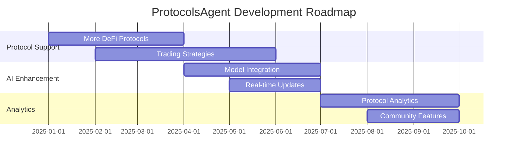

# ProtocolsAgent

AI agent for Solana DeFi protocols based on Eliza framework, integrated with Pyth Network and large language models.

## Overview

ProtocolsAgent is an intelligent agent that combines the classic ELIZA framework with modern AI capabilities to provide an interactive interface for Solana DeFi protocols. It leverages both OpenAI and Claude models for natural language understanding and integrates with Pyth Network for real-time price feeds.

## Features

- **Eliza Framework Integration**
  - Natural language processing for DeFi queries
  - Context-aware conversation handling
  - Pattern matching for protocol-specific commands

- **AI Models Support**
  - OpenAI GPT integration for advanced reasoning
  - Claude AI for alternative processing
  - Hybrid response generation system

- **Solana DeFi Protocols Support**
  - Orca Protocol integration
    - Pool information
    - Swap quotes
    - Liquidity positions
  - Raydium Protocol integration
    - Market data
    - Order book information
    - Trading pairs

- **Pyth Network Integration**
  - Real-time price feeds
  - Price confidence intervals
  - Market data verification

- **RESTful API Endpoints**
  - Comprehensive API documentation
  - Rate limiting and security features
  - Authentication system

## API Endpoints

### Agent Endpoints
```http
POST /api/agent/chat
Content-Type: application/json

{
    "message": "What is the current price of SOL?"
}
```

### Protocol Endpoints
```http
GET /api/protocols/orca?poolAddress={address}
GET /api/protocols/ray?marketAddress={address}
```

## Technical Architecture

```
/src
├── /api                    # API related code
│   ├── /routes            # API route definitions
│   ├── /controllers       # Request handlers
│   └── /middleware        # Express middleware
├── /core                  # Core agent functionality
│   ├── agent.js           # Main agent logic
│   ├── elizaCore.js       # ELIZA implementation
│   └── pythIntegration.js # Pyth Network integration
├── /protocols             # Protocol implementations
│   ├── /orca             # Orca protocol integration
│   └── /ray              # Raydium protocol integration
├── /services             # External services
│   ├── /ai               # AI model services
│   └── /blockchain       # Blockchain services
└── /utils                # Utility functions
```

## Setup and Installation

### Prerequisites
- Node.js v16 or higher
- npm v7 or higher
- Solana CLI tools
- Access to Solana RPC endpoint

### Installation Steps
1. Clone the repository
```bash
git clone https://github.com/ProtocolsAgent/protocols_agent.git
cd protocols_agent
```

2. Install dependencies
```bash
npm install
```

3. Configure environment variables
```bash
cp .env.example .env
# Edit .env with your configuration
```

4. Start the development server
```bash
npm run dev
```

For production:
```bash
npm start
```

## Environment Variables

```env
# Server Configuration
PORT=3000
NODE_ENV=development

# AI Configuration
OPENAI_API_KEY=your_openai_key
CLAUDE_API_KEY=your_claude_key

# Solana Configuration
SOLANA_RPC_URL=your_rpc_url
WALLET_PRIVATE_KEY=your_wallet_key

# Pyth Configuration
PYTH_NETWORK_ENDPOINT=your_pyth_endpoint
```

## Testing

Run the test suite:
```bash
npm test
```

Run with coverage report:
```bash
npm run test:coverage
```

## Project Roadmap



### Phase 1: Q1 2025 - Protocol Expansion
- Integration of additional Solana DeFi protocols
- Development of advanced trading strategies
- Enhanced liquidity pool management
- Automated market making features

### Phase 2: Q2 2025 - AI Capabilities
- Advanced AI model integration
- Real-time WebSocket updates
- Improved natural language processing
- Predictive analytics implementation

### Phase 3: Q3 2025 - Analytics & Community
- Protocol-specific analytics dashboard
- Community-driven feature development
- Performance optimization
- Enhanced security features

## Contributing

1. Fork the repository
2. Create your feature branch (`git checkout -b feature/AmazingFeature`)
3. Commit your changes (`git commit -m 'Add some AmazingFeature'`)
4. Push to the branch (`git push origin feature/AmazingFeature`)
5. Open a Pull Request

## License

This project is licensed under the MIT License - see the [LICENSE](LICENSE) file for details.

## Acknowledgments

- Eliza framework contributors
- Solana ecosystem developers
- Pyth Network team
- OpenAI and Anthropic teams

## Contact

- GitHub: [@ProtocolsAgent](https://github.com/ProtocolsAgent)
- Twitter: [@ProtocolsAgent](https://x.com/ProtocolsAgent)
